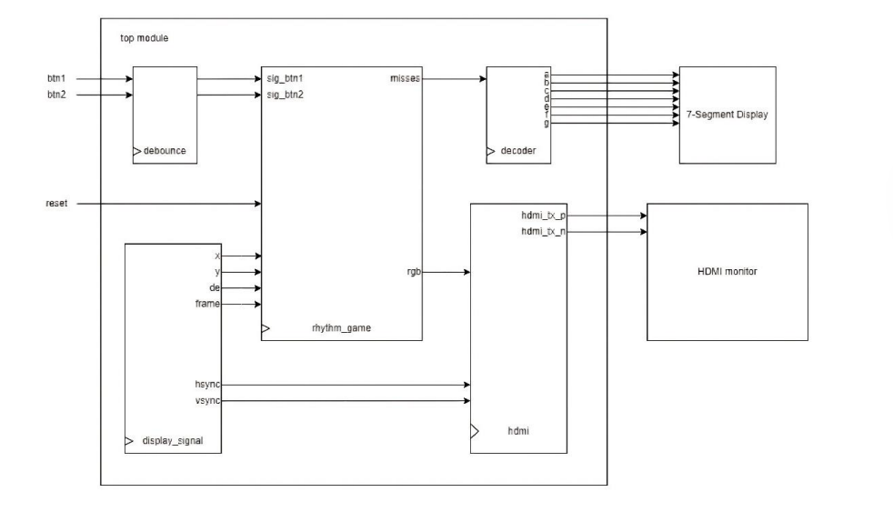

# 🎹 Sound Voltex Demake (FPGA Rhythm Game)

> **"Rhythm Gaming on Hardware Logic"**
> A hardware-based implementation of the popular arcade game "Sound Voltex," designed to run on the Tang Nano 4K FPGA with HDMI output and custom logic circuits.

---

## 📄 Full Technical Report
This repository showcases the Verilog code and logic design. For the complete system architecture, timing diagrams, and experimental results, please view the full report below:

### https://drive.google.com/file/d/1YhV-Hd_e2Hz9FekR3cyth543AcamGfzk/view?usp=sharing
*(Note: Please click the link above to view the analysis file)*

---

## 🔍 Project Overview

### 🎯 Objective
To apply digital system design principles (CPE222) to create a functional rhythm game on an FPGA[cite: 4744, 4753]. [cite_start]The project focuses on handling real-time inputs, processing logic in parallel, and generating video signals (HDMI) directly from hardware logic without an Operating System[cite: 4768].

### 🎮 Key Features
* **Gameplay:** 2-Lane rhythm game using push buttons[cite: 4841].
* **Dynamic Difficulty:** Note speed increases automatically after every 15 successful hits[cite: 4841].
* **Display System:**
    * **Main Screen:** 480p/720p HDMI signal generation via TMDS encoding[cite: 4783, 4844].
    * **UI:** Simple note scrolling and hit zone detection[cite: 4841].
    * **Status:** 7-Segment display shows the "Miss Count" in real-time[cite: 4842].
* **Game Loop:** New Game -> Playing -> Game Over (triggered after 5 misses)[cite: 4819].

### ⚙️ System Architecture
The system is controlled by the `top.sv` module, which orchestrates sub-modules like `rhythm_game`, `hdmi`, and `decoder`.

*(Figure 1: High-level System Block Diagram)*

---

## 🛠️ Hardware & Tech Stack

**Hardware:**
* **FPGA Board:** Sipeed Tang Nano 4K (GW1NSR-LV4C).
* **Input:** 2x Tactile Push Buttons (12x12mm).
* **Output:** HDMI Monitor & 7-Segment Display.

**Software & Tools:**
* **Language:** SystemVerilog.
* [**IDE:** Gowin® EDA, Visual Studio Code.

---

## ⚠️ Challenges & Limitations
* **Audio:** Due to Logic Unit limitations on the Tang Nano 4K, background music could not be implemented in this version.
* **Controls:** Limited to 2 buttons/notes due to GPIO and resource constraints.

---

## 👥 Contributors
*Project for CPE222 Digital Electronics and Logic Design, KMUTT*

* **Mr. Natthanan Jarukornkul** (Game Programming)
* **Mr. Thiti Tiyachaipanich** (Hardware-Software Integration)
* **Mr. Ratchanon Thiptamoon** (Hardware Management)
* **Mr. Saksit Vetchawitthayakhlang** (Game Design)
* **Mr. Thammapon Chaengphatee** (Game Design)

